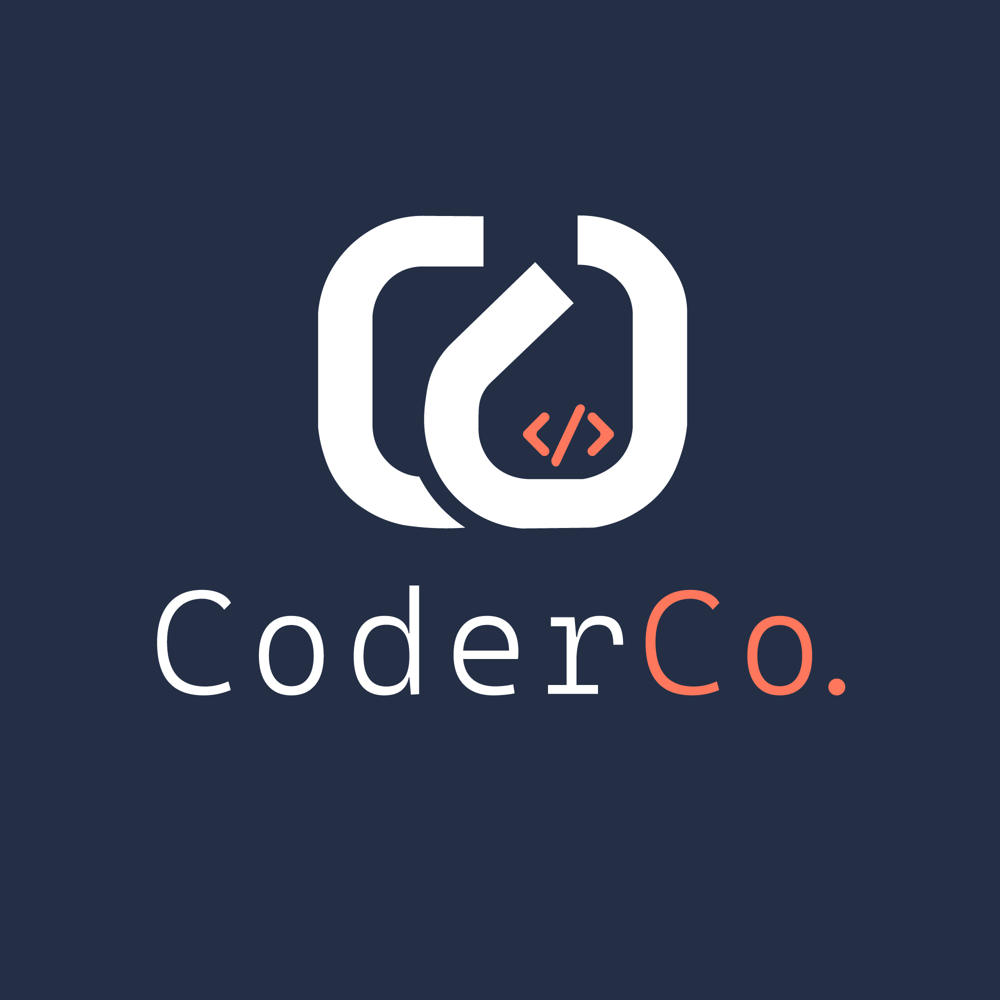

<div align="center">
    
</div>

# CoderCo – K8s Assignment

> **Goal:** Build a production-ready AWS platform on K8s, ship **any** containerised micro-service through policy-guarded pipelines and prove it all works.

---

## 📋 Table of Contents
- [CoderCo – K8s Assignment](#coderco--k8s-assignment)
  - [📋 Table of Contents](#-table-of-contents)
  - [Challenge Overview](#challenge-overview)
  - [Core Requirements](#core-requirements)
  - [Marking Rubric](#marking-rubric)
  - [Bonus Points](#bonus-points)
  - [Deliverables \& Submission ](#deliverables--submission-)
  - [Recommended Repo Layout ](#recommended-repo-layout-)
  - [Grading Bands ](#grading-bands-)

---

## Challenge Overview
You’re the DevOps team of **CoderCo**.

Your task is to:

* 🔧 Spin up AWS infrastructure with **Terraform** (VPC, EKS 1.29 or above). Please use your own modules for resources. 
* 📦 Package **any** micro-service (language irrelevant) using a **multi-stage Dockerfile**.  
* 🔄 Push infra & app through **fully-automated pipelines** (IaC + CI/CD).  
* 🔍 Secure, observe and document the platform well enough for any engineer to run your app or maintain the platform.

Focus on production fundamentals—security, observability, automation and reproducibility. 

---

## Core Requirements
| # | Area | Must-haves |
|---|------|------------|
| 1 | **AWS Foundation** | VPC (public + private), EKS 1.29 or above, cluster-autoscaler, spot & on-demand node groups (or Fargate if you prefer but please explain your choice). |
| 2 | **Micro-service** | Any API/service with health & readiness probes, containerised via multi-stage Docker. |
| 3 | **Pipelines** | Two pipelines:<br>• **iac-pipeline** → `terraform plan` → gated `apply`<br>• **app-pipeline** → build → scan → push → deploy |
| 4 | **Ingress** | Ingress controller of your choice. |
| 5 | **Helm** | Charts for **all** add-ons and the app (versioned & templated). |
| 6 | **Observability** | Prometheus, Grafana dashboards, Loki/Promtail for logs. |
| 7 | **Security** | Trivy scan, tfsec/Checkov, OPA-Gatekeeper cluster policies, PodSecurity Standards. |

---

## Marking Rubric  
*(Core = 100 pts)* <a name="marking-rubric"></a>

| Category | Pts | Evidence We’ll Inspect |
|----------|----:|------------------------|
| **Project Management / Board** | **6** | Epics → tickets, status swim-lanes, PR links. |
| **Terraform AWS Infra** | **18** | Reusable modules (vpc, eks, sg, iam, r53 etc); remote state; spot nodes & autoscaler. |
| **Networking & Ingress** | **8** | Ingress controller of your choice, internal vs public ingress, Calico network-policies or AWS VPC CNI, Route 53 records. |
| **CI Pipeline (IaC)** | **8** | plan/apply gates, tfsec/Checkov, SOPS-encrypted secrets or external secrets, failure alerts. |
| **Container Build & Registry** | **8** | Multi-stage Docker, Trivy SBOM, push to ECR with immutable digests. |
| **CD Pipeline (App)** | **12** | Helm rollout dev → prod, digest pinning, auto-rollback on readiness fail. |
| **Security & Compliance** | **12** | OPA baseline+restricted, IRSA, secret-less images. |
| **Observability** | **12** | Prom scrape configs, Grafana dashboards as JSON, Loki logs, actionable alerts. |
| **Resilience & Scalability** | **8** | HPA, PDBs, disruption budgets, at least one chaos test. |
| **Documentation & Architecture** | **8** | README, diagrams and any useful runbooks. |
| **TOTAL CORE** | **100** |  |

---

## Bonus Points

*(+20 pts max – shoot your shot)* <a name="bonus-opportunities"></a>

| Bonus Item | Pts | Full-Credit Expectations |
|------------|----:|--------------------------|
| **GitOps (Argo CD or Flux)** | **7** | App + infra in sync-waves, drift PRs. |
| **Service Mesh (Istio ≥ 1.22)** | **7** | Mesh-wide mTLS, traffic split (v1/v2), ingress-gateway. |
| **Cert-Manager + ExternalDNS** | **3** | ACME cert automation + Route 53 record mgmt. |
| **Cost Visibility (Kubecost/OpenCost)** | **3** | Dashboard of namespace & asset spend. |
| **TOTAL BONUS** | **20** |  |

---

## Deliverables & Submission <a name="deliverables--submission"></a>

1. **Repository** containing:  
   * Terraform code (`/infra`), Helm charts (`/helm`), app code (`/app`).  
   * GitHub Actions/GitLab CI YAML.  
2. **README.md** (this file) updated with:  
   * One-command bootstrap (`make deploy` or similar).  
   * Point-and-click architecture diagram (`architecture.drawio` / `.png`).  
   * Links to dashboards & project board (optional).  
3. **Screenshot bundle** – Grafana, Trivy, Checkov, OPA outputs.
4. **OPTIONAL - Two short demo videos** (≤ 2 min each):  
   1. Terraform pipeline run.  
   2. App pipeline → rollout + rollback.  

Push everything to a public repo and submit the link via Discord. If you keep private, please invite us to the repo. Please don't push any secrets or any sensitive files/info/docs. 

---

## Recommended Repo Layout <a name="recommended-repo-layout"></a>

You may implement your own layout but here's a suggested one:

```bash
.
├── README.md ## this file
|---.github/workflows ## CICD pipelines
├── architecture.drawio ## architecture diagram
├── .gitignore ## ignore files
├── Makefile ## for deployment
├── helm ## helm charts for add-ons and app
│   └── ...
├── infra ## terraform code for aws infra
│   └── ...
├── app ## micro-service + Dockerfile etc
│   └── ...
```

---

## Grading Bands <a name="grading-bands"></a>

| Score | Verdict |
|-------|---------|
| < 70  | Needs improvement – key production gaps. |
| 70 – 84 | Pass – meets minimum prod standard. |
| 85 – 99 | Solid – production-ready. |
| ≥ 100 (incl. bonus) | Wizard – exceeded core scope. |

---
